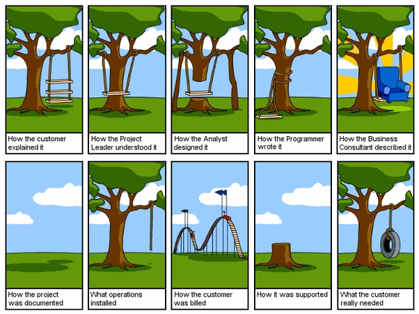

# ART. 6 DEPANNAGE REPARATIONS
Le locataire bénéficie pendant la durée de sa location d'une assistance par téléphone au n° vert indiqué sur le matériel. En cas de panne, dysfonctionnement ou dégradation au cours , il doit immédiatement cesser d'utiliser le matériel, aviser le  par téléphone et lui adresser confirmation par écrit relatant les circonstances sous 72h. Toute réparation n'est effectuée.

# ART.7 COMICS
Un petit comic pour se détendre:

